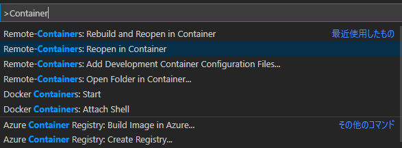

# 開発環境立ち上げに必要な手順

---
## Docker Desktopの導入
1. Docker Desktop

    1.1 Install

    1.2 Setting

※説明のために、DockerDesktopやVSCodeのスクリーンショット画像を含みますが、問題があれば削除します。

---
### 1.1 Install
1. 下記のリンクページから「DockerDesktop」のインストーラをダウンロードする。
[Get Started with Docker](https://www.docker.com/get-started)
1. DockerDesktopのインストーラを実行し、インストールを行う。
※基本的にはNextで続けてよい。設定値に迷ったら他の人に相談すること。
1. WindowsのスタートメニューからDockerDesktopを起動する。
※タスクトレイにDockerのロゴマークが表示されればOK。
　ロゴマークがアニメーションしているうちは、起動が完了していない状態を表す。

---
### 1.2 Setting
※動作が遅い場合に調整してください。
1. DockerDesktop起動後、タスクトレイに存在するDockerのロゴマークをクリックし、メニューを表示させる。
1. メニューから「Settings > Resources > ADVANCED」と進む。
1. Dockerに割り当てるリソースの割合を調整する。
    - Dockerのコンテナの動作が遅ければ、割り当てを大きくする。
    - Docker以外のアプリの動作が遅ければ、割り当てを小さくする。
1. 「Apply & Restart」をクリックし、変更を適用する。
1. Dockerの再起動が終わるまで待つ。

---

## VSCodeの導入
2. VSCode
2.1 Install
2.2 Extension
2.3 Open in Container

---
### 2.1 Install
1. 下記のリンクページから「Visual Studio Code」（以下：VSCode）のインストーラをダウンロードする。
[Download Visual Studio Code](https://code.visualstudio.com/download)
1. VSCodeのインストーラを実行し、インストールを行う。
※基本的にはNextで続けてよい。設定値に迷ったら他の人に相談すること。

---
### 2.2 Extension
1. VSCodeを起動する。
2. 画面左下の設定ボタンを押下する。
3. 「拡張機能(Extension)」を選択し、拡張機能パネル上部の検索窓で以下のExtensionを検索し、インストールする。
※「MS-CEINTL.vscode-language-pack-ja」をインストールした時点で日本語化されるはず。
    - 必須
        MS-CEINTL.vscode-language-pack-ja
        ms-vscode-remote.remote-containers
    - 任意
        ms-azuretools.vscode-docker

---
### 2.3 Open in Container
1. VSCodeでリポジトリのルートフォルダを開く。
1. 「Ctrl + Shift + P」でパレットを表示し、「Container」と入力する。
1. パレットの候補が絞られるので「Remote-Containers: Reopen in Container」を選択。

1. プロジェクトに含まれる仮想環境設定に従ってコンテナが起動され、コンテナ内に接続されたVSCodeが立ち上がる。
